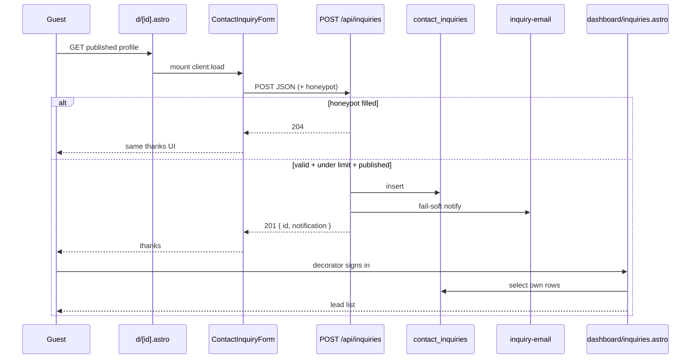

# Research: Inquiry / contact-lead north star

**Date**: 2026-09-13T09:40:00+02:00
**Researcher**: 10x-research (m4l3 Deep Focus)
**Git Commit**: 18aedd3cfdc89af1325f3190f52fcb3f20f7784e
**Branch**: cursor/domain-schema-foundation-change-tracking
**Repository**: Event-Book

One-line goal: research the inquiry / contact-lead north star (guest submit → persist → decorator inbox) **from** `src/pages/api/inquiries/index.ts`, **because** the map names it as the only handler with Ce=6, test-plan risks #3/#5 sit on this slice, and `d/[id].astro` mounts `ContactInquiryForm` off-graph.

Working-tree note: HEAD is `chore: add dependency-cruiser…`; inquiry files also have uncommitted edits. This report describes the files as read on disk on 2026-09-13, not the commit blob alone.

## Research Question

How does the EventBook inquiry / contact-lead north star actually run today — guest inquiry on a public decorator profile, through the API, into the decorator inbox — and what concrete debt and test gaps sit on that path? Map priors: `context/mapping/repo-map.md` (handler Ce=6; `.astro` off-graph; test-plan #3/#5).

## Summary

The lead slice is a single public write plus a session-scoped read. A guest who can open a published profile (`/d/:id`) hydrates `ContactInquiryForm`, which POSTs JSON to `/api/inquiries`. The handler is unauthenticated: honeypot → schema → per-isolate rate limit → published-profile check → insert `contact_inquiries` → fail-soft Resend email → `201`. The decorator later sees the row on `/dashboard/inquiries` via `locals.user` → own `decorator_profiles.id` → `contact_inquiries` (RLS `select_own` is the real ownership gate). Email is a side channel; HTTP success means “row accepted,” not “mail delivered.” Unit coverage is leaf-heavy and mock-heavy; the cheap missing proofs are 429 ⇒ no row (risk #5) and decorator-A cannot read decorator-B (risk #4). An e2e already covers risk #3’s happy path (confirmation + owning decorator sees the lead).

## Feature overview

Flow, not a file list. Each step is tagged **evidence** / **inference** / **unknown**.

### Guest finds a published decorator

1. Search lists published supply and links to `/d/{profile.id}` (**evidence**: `src/pages/search.astro` builds `href={`/d/${profile.id}`}`; `fetchPublishedDecorators` is the query helper).
2. `src/pages/d/[id].astro` loads `decorator_profiles` with `.eq("is_published", true)` and 404s if missing (**evidence**: lines 20–28). Portfolio photos on the same page are `.eq("moderation_status", "approved")` (**evidence**: lines 35–41) — that is risk #1, not the lead write.
3. The same shell mounts the lead island: `<ContactInquiryForm decoratorProfileId={profile.id} companyName={profile.company_name} client:load />` (**evidence**: `src/pages/d/[id].astro:137`). Cruiser does not see this edge (**unknown** in the TS/TSX graph; **evidence** from the map that `.astro` is off-graph).

**Structural claim A:** `ContactInquiryForm` is mounted from this public profile page and from no other `src` page. (Verified later.)

### Guest submits contact details

4. The island is a client `fetch`, not a form POST to Astro (**evidence**: `ContactInquiryForm.tsx:56-60` — `fetch("/api/inquiries", { method: "POST", … })` with `decorator_profile_id` plus form fields including hidden `company_website`).
5. The form does **not** import `inquiry-schema` or `inquiry-abuse` (**evidence**: imports are `ServerError`, `FormField`, `Button`, `ApiErrorBody`). Server validation stays on the handler. Shared `FormField` (also used by sign-in, sign-up, profile, portfolio) owns the accessible labels the e2e locators depend on (**evidence**: five `FormField` import sites under `src/components`).
6. Client success is `response.status === 204 || response.ok` (**evidence**: `ContactInquiryForm.tsx:62-65`). A honeypot 204 is shown as “Thanks — your inquiry was sent to {companyName}” on purpose.

**Structural claim B:** the only `src` caller of `fetch("/api/inquiries", …)` is `ContactInquiryForm`.

### Handler composes the write (only Ce=6 API route)

7. `src/pages/api/inquiries/index.ts` exports `prerender = false` and **only** `POST` (**evidence**: `export const POST` at line 18; no `GET`/`PATCH`/`DELETE` in that file). It does not import `@/lib/api-auth` (**evidence**: import list is `api-error`, `inquiry-abuse`, `inquiry-email`, `inquiry-schema`, `supabase`, `ContactInquiry`). Guest POST therefore bypasses `requireAuth` / `requireAdmin` / `requireDecoratorProfile` — those gates are used by admin / portfolio / profile handlers instead (**evidence**: `api-auth` call sites listed in Code References).
8. Sequence inside `POST` (**evidence**, `index.ts:18-91`):
   1. `createClient` → `503 SUPABASE_NOT_CONFIGURED` if null.
   2. `request.json()` → `400 VALIDATION_FAILED` on non-JSON.
   3. `hasInquiryHoneypotContent(company_website)` → empty `204`, **before** rate limit and insert.
   4. `parseInquiryBody` (zod: UUID, name, email, optional phone, `YYYY-MM-DD`, needs ≥ 10 chars; honeypot stripped).
   5. `getInquiryClientIp` then `consumeInquiryRateLimit(ip, decorator_profile_id)` → `429 RATE_LIMITED` with `retryAfterMs`.
   6. Load `decorator_profiles` by id **and** `is_published = true` → `500 PROFILE_FETCH_FAILED` or `404 PROFILE_NOT_FOUND`.
   7. `crypto.randomUUID()` + insert into `contact_inquiries`.
   8. `sendInquiryNotification` (fail-soft) then `201` with `{ inquiry: { id }, notification }`.
9. Map reason this file is the Deep Focus entry: metrics snapshot 2026-09-13 gives this module Ca=1, **Ce=6**, I=86% — `api-error` + `inquiry-abuse` + `inquiry-email` + `inquiry-schema` + `supabase` + `types`. Artifact and repo-map call it the **only handler with Ce>4** (**evidence** from `context/mapping/artifact-1-testability-risks.md` and `repo-map.md`; not re-cruised in this session).

**Structural claim C:** production call-sites of `parseInquiryBody`, `sendInquiryNotification`, and `consumeInquiryRateLimit` are this handler only (tests aside).

**Structural claim D:** TypeScript writes `contact_inquiries` only in this handler (`$_.from("contact_inquiries").insert`). The decorator read lives in `dashboard/inquiries.astro` (off ast-grep’s TS/TSX parse).

### Abuse and email are leaf helpers

10. Rate limit is a module-level `Map` keyed `${ip}:${decoratorProfileId}`, 5 requests / 10 minutes, sweep every 100 calls (**evidence**: `inquiry-abuse.ts:1-62`). IP comes only from `cf-connecting-ip`; missing header → `"unknown"`; `x-forwarded-for` is ignored (**evidence**: `getInquiryClientIp`, lines 31–36, plus comment). Comment on the `Map` states per-isolate / Workers recycling — not a cross-request guarantee (**evidence**: lines 11–15).
11. Email reads `RESEND_API_KEY`, `RESEND_FROM_EMAIL`, `RESEND_TO_OVERRIDE` from `astro:env/server` and POSTs `https://api.resend.com/emails` (**evidence**: `inquiry-email.ts:42-69`). Skip reasons: `missing_contact`, `not_configured`, `provider_error`. Never throws to the handler (**evidence**: all branches return `{ sent }`). `RESEND_TO_OVERRIDE` empty string falls through via `||` (**evidence**: line 53).
12. Insert happens **before** email. A failed notify still returns `201` with `notification.sent: false` (**evidence**: handler lines 85–91; unit `index.test.ts` “returns success even when email delivery fails after insert”). Test-plan #3 therefore treats “lead in panel” as the delivery oracle, not the inbox.

### Decorator inbox (session + RLS)

13. `PROTECTED_ROUTES = ["/dashboard"]` — any path under `/dashboard` without `locals.user` redirects to `/auth/signin` (**evidence**: `middleware.ts:4-24`). `/api/inquiries` is not on that list.
14. `src/pages/dashboard/inquiries.astro` (off-graph): if `supabase && user`, load `decorator_profiles.id` for `user.id`; if missing, show “Complete your profile first”; else select `contact_inquiries` for that profile id, newest first, limit 51, display 50 (**evidence**: lines 16–32, 55–74). Nav: `DashboardLayout` + dashboard tile (**evidence**: `DashboardLayout.astro:16`, `dashboard.astro:175`).
15. RLS (**evidence**, `supabase/migrations/20260620130000_domain_rls.sql:123-146`):
    - `INSERT` for `anon, authenticated` only if the target profile `is_published = true`.
    - `SELECT` for authenticated via `current_decorator_profile_id()` (own rows) or `is_admin()`.
    - No `UPDATE`/`DELETE` policies in that migration — default deny (**inference**: Postgres RLS default is deny when enabled and no policy matches; not runtime-proven here).

## Technical debt

Concrete risks on this flow, not “sloppy.” Same evidence tags.

### 1. Confirmation can mean “spam discarded,” not “lead stored”

**Risk:** honeypot `204` and real `201` share the thanks UI (`ContactInquiryForm.tsx:62-65`). A bot (or a curious guest who typed in the off-screen field) sees success and no row appears. **Evidence** of the short-circuit: handler returns `204` before parse/limit/insert. **Inference:** this is intentional anti-enumeration (impl-review F3-era honeypot notes). **User-visible:** looks like test-plan #3 (“confirmation but decorator never receives the lead”) if someone treats the thanks copy as the oracle. The existing e2e asserts HTTP `201` *and* the panel row, so it does not confuse 204 with delivery.

### 2. Rate limit is per-isolate and is not proven to block persistence

**Risk (test-plan #5):** flood/junk stored as a real lead.

- In-memory `Map` does not coordinate across Worker isolates (**evidence**: comment `inquiry-abuse.ts:11-15`). Distinct isolates each allow 5/10min per `ip:profile`.
- Missing `cf-connecting-ip` collapses everyone to key `unknown:{profileId}` (**evidence**: `getInquiryClientIp`). Locally that serializes guests; in a misconfigured edge it could over-block or, if somehow varied, under-block. **Unknown:** whether production always sets the header (Cloudflare usually does; not observed here).
- Limit is consumed **after** validation and **before** the published-profile check and insert (**evidence**: `index.ts:39-73`). Unpublished/unknown UUIDs that pass zod still spend budget. Failed inserts still spent budget.
- Handler unit **mocks** `@/lib/inquiry-abuse` (**evidence**: `index.test.ts:17-21`). There is **no** test that a 6th POST returns 429 **and** does not call `insert`. Abuse unit only checks the `Map` in isolation (`inquiry-abuse.test.ts`). **Evidence** of the gap; this is the cheapest missing #5 proof.

Sweep every 100 calls was added after impl-review F1 (**historical**: `context/changes/contact-lead-flow/reviews/impl-review.md`). Unbounded growth is mitigated, not the isolate split.

### 3. Email fail-soft is correct and easy to misread as “delivered”

**Risk:** decorator never sees the lead *in email* while the client got `201`. **Evidence:** handler always `201` after successful insert; `sendInquiryNotification` returns `{ sent: false }` for missing `contact_email`, missing Resend env, or provider errors; unit covers “success even when email delivery fails.” Test-plan #3 explicitly says email is a separate channel. **Debt:** there is **no** `inquiry-email.test.ts` — skip-reason branches and `RESEND_TO_OVERRIDE` are untested. **Inference:** production notify quality is an ops/config concern (secrets, `contact_email` on published profiles), not a missing insert.

The `ContactInquiry` passed to email is assembled in-process (`created_at: new Date().toISOString()`) rather than returned from the insert (**evidence**: `index.ts:81-84`). **Inference:** email timestamp can differ from the DB `created_at` the panel shows; id/body fields still match the insert payload.

### 4. Ownership lives in the `.astro` query + RLS, and has no test

**Risk (test-plan #4):** decorator A reads decorator B’s inquiries.

- App filter: `user.id` → own profile id → `.eq("decorator_profile_id", profile.id)` (**evidence**: `dashboard/inquiries.astro:16-27`). There is no inquiry id in the URL and no GET `/api/inquiries`.
- RLS `contact_inquiries_select_own` uses `current_decorator_profile_id()` (**evidence**: migration). Admin can `SELECT` all.
- **No** `src/**/*.test.ts` covers cross-decorator reads. E2E #3 logs in the *owning* florist only. **Evidence** of absence. Mocking the query builder would hide RLS (test-plan anti-pattern).

**Unknown:** whether `current_decorator_profile_id()` is tested elsewhere (not in this slice’s tests). Not opened in this session.

### 5. Off-graph shells are the real orchestrators

**Risk:** a graph-only change (handler Ce, lib leaves) misses the two pages that mount and display the lead.

- `d/[id].astro` decides who even sees the form (published profile or 404) and passes `decoratorProfileId` (**evidence**).
- `dashboard/inquiries.astro` decides who sees rows (profile existence, 50-cap, empty copy) (**evidence**).
- Repo-map: cruiser extensions are `.ts`/`.tsx`/`.d.ts` only. **Evidence** from `repo-map.md` / artifact-2. Changing either shell does not move Ca/Ce.

### 6. Shared `FormField` couples e2e #3 to four other islands

**Risk:** a label/`id` tweak in `src/components/auth/FormField.tsx` breaks `tests/e2e/inquiry-confirmation-reaches-decorator.spec.ts` (`getByRole("textbox", { name: "Your name" })` etc.) and also sign-in / profile / portfolio. **Evidence:** five import sites; e2e `fillInquiryForm`. Folder name `auth` is not a feature boundary (**map**).

### 7. Handler unit does not exercise several live branches

Covered with mocks: `503`, honeypot `204` (and limiter not called), happy `201` + email args, unpublished `404`, email-fail `201`.

**Not covered in `index.test.ts` (evidence — no such tests):** invalid JSON `400`; zod `VALIDATION_FAILED` `400`; `429` + no insert; `PROFILE_FETCH_FAILED` `500`; insert error `INQUIRY_CREATE_FAILED` `500`. Schema unit covers some zod failures in isolation. **Inference:** a regression that inserts on 429 or on unpublished-after-mock-slip would not be caught by current handler tests.

### 8. Public write surface is intentionally wide

**Evidence:** RLS insert is `TO anon, authenticated` against any published profile id. Anyone who can guess/list a published UUID can POST (search already lists them). Abuse controls are honeypot + isolate `Map`, not auth. **Inference:** this matches guest lead-gen; it is the reason #5 exists. **Unknown:** production traffic / actual abuse.

## Detailed Findings

### Trace 1 — E2E happy path (file:line)

| Step | Where | What happens |
|------|--------|----------------|
| Entry | `search.astro` → `/d/{id}` | Guest opens published profile |
| Gate | `d/[id].astro:20-28` | `is_published=true` or 404 |
| Mount | `d/[id].astro:137` | `ContactInquiryForm` `client:load` |
| Submit | `ContactInquiryForm.tsx:49-66` | `POST /api/inquiries`; 204/2xx → thanks |
| Persist | `api/inquiries/index.ts:52-78` | published check + insert |
| Notify | `inquiry-email.ts:31-86` | fail-soft Resend |
| Session | `middleware.ts:21-24` | `/dashboard*` requires user |
| Inbox | `dashboard/inquiries.astro:16-32` | own profile’s latest ≤50 rows |

Playwright already walks this: `tests/e2e/inquiry-confirmation-reaches-decorator.spec.ts` (risk #3). It waits for POST `201`, asserts thanks copy, signs in via `/api/auth/signin`, and checks `/dashboard/inquiries` for the unique client name/email. Cleanup deletes by `client_email` through `npx supabase db query`.

### Trace 2 — Test gaps

| Layer | Exists | Proves | Misses |
|-------|--------|--------|--------|
| `inquiry-schema.test.ts` | yes | accept + strip honeypot; reject bad email/date/short needs | empty name; bad UUID; phone transform |
| `inquiry-abuse.test.ts` | yes | honeypot trim; cf-ip vs xff; 5th ok / 6th limited; window reset | sweep; shared `"unknown"` IP; handler 429⇒no insert |
| `inquiry-email` | **no test file** | — | all skip/send branches |
| `api/inquiries/index.test.ts` | yes, 3 mocks (`supabase`, email, abuse) | 503, 204, 201+notify, 404 unpublished, 201 when email false | 400/429/500 insert; real DB; RLS |
| E2E #3 | yes | confirmation + owner panel row | 204 vs 201; flood; foreign decorator |
| E2E #4 / #5 | **no** | — | ownership; abuse persist |
| Vitest for `d/[id].astro` / `dashboard/inquiries.astro` | **no** | — | published 404; empty/cap inbox |

Test-plan §3 phase 2 (“Lead-gen + discovery contracts”, risks #3–#6) is still `not started`. Phase 1 e2e #3 is extra coverage ahead of that phase, not a substitute for the 429 and ownership integrations.

### Trace 3 — Blast radius

What must move together if this flow changes.

| Seam | Coupled to | Why |
|------|------------|-----|
| `ContactInquiry` / `CreateContactInquiryInput` in `types.ts` (Ca=15 hub) | handler insert shape, email input, inbox cast | one field rename hits write + notify + panel |
| `jsonError` / `ApiErrorBody` (`api-error.ts`, Ca=14) | handler codes; form `VALIDATION_FAILED` field map | UI depends on `error.code` and `error.context.fields` |
| `inquiry-schema` | handler only in `src` (not the island) | keep it that way — pulling zod into the form is the map’s first cycle warning |
| `inquiry-abuse` `Map` + `resetInquiryRateLimitBuckets` | handler + abuse unit | changing the key or window without an integration leaves #5 unproven |
| `inquiry-email` env + `fetch` | handler only | mock at this boundary; do not e2e Resend |
| `createClient` / `supabase.ts` | 6 TS call-sites (handler, middleware, `api-auth`, 3 auth routes) plus 6 `.astro` shells including `d/[id]` and `dashboard/inquiries` | real fan-in > cruiser’s Ca=7 |
| RLS `contact_inquiries_*` | anon insert + owner select | app filter is defense-in-depth, not the only gate |
| `FormField` labels | e2e #3 + four other forms | locator blast |
| `PROTECTED_ROUTES` | inbox URL | guest POST must stay off the list |
| `d/[id].astro` / `dashboard/inquiries.astro` | mount + read | off-graph; cruiser will not flag them |

Git co-change on this slice (subject log, not a new scan): `b23fee4` / `4728abb` (S-02 public profile), `b210f67` (S-03 form + API + panel), `212935b` (surface `notification` on 201). `d/[id].astro` already moved with discovery *and* lead — it is a shared shell, not an inquiry-only file.

## Code References

- `src/pages/d/[id].astro:20-28` — published-profile gate (404)
- `src/pages/d/[id].astro:137` — only `ContactInquiryForm` mount (`client:load`)
- `src/components/discovery/ContactInquiryForm.tsx:56-65` — `fetch` POST; 204 treated as success
- `src/pages/api/inquiries/index.ts:18-91` — unauthenticated compose: honeypot → schema → limit → publish check → insert → notify
- `src/pages/api/inquiries/index.ts:13-15,21,28,47,60,64,78` — `jsonError` codes on this route
- `src/lib/inquiry-schema.ts:23-39` — `parseInquiryBody` / honeypot strip
- `src/lib/inquiry-abuse.ts:9-62` — isolate `Map`, `cf-connecting-ip` only
- `src/lib/inquiry-email.ts:31-86` — fail-soft Resend
- `src/pages/dashboard/inquiries.astro:16-32` — owner list, cap 50
- `src/middleware.ts:4-24` — `/dashboard` session gate; inquiry POST not listed
- `src/lib/api-auth.ts` — used by admin/portfolio/profile APIs, **not** inquiries
- `src/types.ts:32-41,66-73` — `ContactInquiry` / `CreateContactInquiryInput`
- `supabase/migrations/20260620120000_domain_schema.sql:35-51` — table + index
- `supabase/migrations/20260620130000_domain_rls.sql:123-146` — insert published / select own / admin select
- `src/pages/api/inquiries/index.test.ts` — three-boundary mocks
- `tests/e2e/inquiry-confirmation-reaches-decorator.spec.ts` — risk #3 e2e

`requireAuth` / `requireAdmin` / `requireDecoratorProfile` production call-sites (for contrast — inquiry is absent): `src/pages/api/admin/portfolio/[id].ts`, `src/pages/api/portfolio/{index,upload,[id]}.ts`, `src/pages/api/profile/{index,avatar}.ts`.

## Architecture Insights

- Stack direction holds: island → handler → `lib` leaves → `types`. The form does not import the zod module. The handler does not import `api-auth`.
- “North star” work is concentrated: one POST, one island, one inbox page, two `lib` helpers. Complexity is **composition + side effects** (Map, Resend, RLS), not a cycle.
- Two definitions of “delivered”: (1) row visible to the owning decorator (test-plan #3), (2) Resend `sent: true`. The product UI only claims (1) in the thanks copy, but the copy does not mention email at all.
- Graph metrics under-count the slice because both user-visible ends are `.astro`.

## Historical Context (from prior changes)

- `context/changes/contact-lead-flow/` (status `impl_reviewed`, not archived) — S-03 ship: form, POST, Resend, `/dashboard/inquiries`. Locked choices still visible in code: honeypot + light rate limit; email fail-soft; notify `contact_email` only.
- `context/changes/contact-lead-flow/reviews/impl-review.md` — F1 Map sweep **fixed**; F2 per-isolate comment **fixed**; F3 dropped spoofable `x-forwarded-for` **fixed**; F4 50-row overflow note **fixed**; F5 default export **fixed**; F6 multiline `FormField` **fixed**. Remaining debt is the isolate limiter and the mock/integration split, not those review items.
- `context/foundation/test-plan.md` risks #3/#4/#5 and Phase 2 still name this slice as the next cheap-test investment.
- `context/mapping/repo-map.md` + `artifact-1-testability-risks.md` — why this file: only handler Ce=6; `#3/#5`; `d/[id].astro` off-graph.

## Related Research

No other `context/changes/**/research.md` or `context/archive/**/research.md` exists in this repo at write time. Closest prose: contact-lead-flow plan/impl-review and the mapping artifacts above.

## Open Questions

- Production: is `cf-connecting-ip` always present on the Worker? If not, all guests share the `unknown` bucket per profile.
- Is `current_decorator_profile_id()` covered by any SQL/integration test outside this slice?
- Should Phase 2’s first integration be 429⇒no insert (#5) or A-vs-B select (#4)? Both are cheaper than more e2e.
- Working-tree drift vs HEAD on `inquiry-abuse`, `ContactInquiryForm`, `d/[id].astro`, `dashboard/inquiries.astro` — confirm before any later plan that the disk version is the intended baseline.

## ast-grep verification

Tool: `@ast-grep/cli` **0.45.3** (`ast-grep run -p … -l typescript|tsx`). Lines below are **1-based** (ast-grep’s `range.start.line` is 0-based; +1 to match the file). Searched `src` only. Every **zero** was re-checked with ripgrep (lesson: count with ast-grep, confirm absence with grep). `.astro` is not a first-class ast-grep language — zeros there are “parser blind,” not “does not exist,” until grep says so.

| # | Claim | Pattern | Verdict | Sites |
|---|--------|---------|---------|--------|
| A | `ContactInquiryForm` is mounted from `d/[id].astro` and no other `src` page | `<ContactInquiryForm $$$ />` (`tsx`) → **0**; identifier `ContactInquiryForm` (`tsx`) → definition only | **refined** | ast-grep cannot see `.astro` JSX. Grep: import + mount **only** `src/pages/d/[id].astro:4` and `:137`. Identifier in TSX is the default export `ContactInquiryForm.tsx:32`. No other `.ts`/`.tsx`/`.astro` mount. |
| B | Only `src` caller of `fetch("/api/inquiries", …)` is the form | `fetch("/api/inquiries", $$$)` (`tsx`/`typescript`) | **confirmed** | `ContactInquiryForm.tsx:56` (tsx=1). `typescript`=0; grep finds the same single site. Bare `fetch("/api/inquiries")` =0 because the call always has a second argument (bad pattern, not absence). |
| C1 | Production `parseInquiryBody($ARG)` is the handler only | `parseInquiryBody($ARG)` | **confirmed** | Production: `api/inquiries/index.ts:39`. Tests: `inquiry-schema.test.ts:7`, `:31`. Import of the function: only `index.ts:6`. |
| C2 | Production `sendInquiryNotification($ARG)` is the handler only | `sendInquiryNotification($ARG)` / `await sendInquiryNotification($$$)` | **confirmed** | Sole real call: `api/inquiries/index.ts:85`. Import: `index.ts:5`. Tests mock the module; they do not call the real function. Definition: `inquiry-email.ts:31` (typed-export pattern `export async function sendInquiryNotification($ARG)` returned 0 — type annotation; grep confirmed the def). |
| C3 | Production `consumeInquiryRateLimit` is the handler only | `consumeInquiryRateLimit($$$)` | **confirmed** | Production: `index.ts:45`. Tests: `inquiry-abuse.test.ts:39,42,50,52`. Same shape for `hasInquiryHoneypotContent` (`index.ts:35` + 3 tests) and `getInquiryClientIp` (`index.ts:44` + 2 tests). |
| D | `contact_inquiries` write only in the handler; read only in the inbox page | `from("contact_inquiries")` → **0** (free-fn, bad pattern); `$_.from("contact_inquiries")` → 1; `.insert($ARG)` → 1 | **refined** | TS write: `index.ts:73` only. Grep adds the `.astro` read: `dashboard/inquiries.astro:23`. No other `src` table access. |
| E | Inquiries API exports **only** `POST` | `export const $M: APIRoute = $$$` in `src/pages/api/inquiries`; also `GET`/`PATCH`/`DELETE` | **confirmed** | One match: `POST` at `index.ts:18`. GET/PATCH/DELETE =0 and grep =0 (truly absent). Repo-wide APIRoute exports = **13** methods; this route contributes exactly one. |
| F | Inquiry POST does not go through `api-auth` | `requireAuth` / `requireAdmin` / `requireDecoratorProfile` under `src/pages/api/inquiries` | **confirmed** | All three =0; grep of `api-auth` / those names in that folder =0 (truly absent). Contrast: `requireAuth($ARG)` elsewhere = 3 profile + 2 portfolio index + `[id]` + upload + avatar (plus the `requireAdmin` wrapper call inside `api-auth.ts:25`). `requireAdmin` production: `api/admin/portfolio/[id].ts:12`. `requireDecoratorProfile`: portfolio `index.ts:16,41`, `[id].ts:14`, `upload.ts:54`. |
| G | Form does not import `inquiry-schema` / `inquiry-abuse` | `parseInquiryBody($ARG)` (`tsx`); identifier `inquiry-schema` (`tsx`) | **confirmed** | Both 0; grep of `inquiry-schema` / `inquiry-abuse` / `parseInquiryBody` under `src/components/discovery` =0 (truly absent). |
| H | Handler reports errors via `jsonError($$$)` (seven times) | `jsonError($$$)` on `index.ts` | **confirmed** | 7 calls: `index.ts:13,21,28,47,60,64,78`. Not exclusive: **51** `jsonError` calls across `src` (`api-error` hub). |
| I | `FormField` is shared (inquiry + auth + decorator) | `import { FormField } from "@/components/auth/FormField"` (`tsx`); `<FormField $$$ />` | **confirmed** | 5 imports: `SignInForm.tsx:3`, `SignUpForm.tsx:3`, `ContactInquiryForm.tsx:5`, `ProfileForm.tsx:5`, `PortfolioEntryForm.tsx:5`. 20 JSX sites; 5 of them in the inquiry form (`:119,:130,:145,:157,:170` (raport: 120, 131, 146, 158, 171)). |
| J | `createClient` is used by the handler and both inquiry shells | `createClient($A, $B)` (`typescript`/`tsx`) | **refined** | TS =6: `middleware.ts:7`, `api-auth.ts:7`, `signin.ts:9`, `signup.ts:9`, `signout.ts:5`, `inquiries/index.ts:19`. `tsx`=0 (truly no React caller). Grep of `.astro` adds 6 shells: `d/[id].astro:13`, `dashboard/inquiries.astro:9`, plus `dashboard.astro`, `dashboard/profile.astro`, `dashboard/portfolio.astro`, `search.astro`. Map’s “real Ca > 7” stands. |
| K | Only inquiries handler has Ce=6 | not an AST count — map metrics | **not re-cruised** | Import list still matches the 2026-09-13 metrics (`api-error`, `inquiry-abuse`, `inquiry-email`, `inquiry-schema`, `supabase`, `types`). Left as map **evidence**, not an ast-grep verdict. |
| L | Resend `fetch` lives only in `inquiry-email` | `fetch("https://api.resend.com/emails", $$$)` | **confirmed** | `inquiry-email.ts:56` only. Grep `api.resend.com` = same single site. |

### Zeros: bad pattern vs truly absent

| Pattern | ast-grep | Grep | Classification |
|---------|----------|------|----------------|
| `<ContactInquiryForm $$$ />` in `tsx` | 0 | mount at `d/[id].astro:137` | **parser blind** (`.astro`) |
| `ContactInquiryForm` in `typescript` | 0 | no `.ts` hits | **truly absent** in `.ts` |
| `fetch("/api/inquiries")` (one arg) | 0 | two-arg call at `ContactInquiryForm.tsx:56` | **bad pattern** |
| `from("contact_inquiries")` (free fn) | 0 | member call at `index.ts:73` + `.astro:23` | **bad pattern**; refined to `$_.from` |
| `requireAuth`/`requireAdmin`/`requireDecoratorProfile` in inquiries API | 0 | 0 | **truly absent** |
| `parseInquiryBody` / `inquiry-schema` in `tsx` | 0 | 0 under discovery | **truly absent** |
| `GET`/`PATCH`/`DELETE` on inquiries route | 0 | 0 | **truly absent** |
| `createClient` in `tsx` | 0 | 0 in `.tsx`; 6 in `.astro` | **truly absent** in React; shells are `.astro` |
| `export async function sendInquiryNotification($ARG)` | 0 | def at `inquiry-email.ts:31` | **bad pattern** (typed parameter) |

No structural claim was **refuted**. Two were **refined** (A: mount is `.astro`-only; D/J: table read and extra `createClient` sites are `.astro`, invisible to the TS/TSX scan). Body text above matches these verdicts.

## ④ Refactor opportunities

Built only on § Technical debt and the traces above. Problems are listed first so the classification can be checked. Each candidate was then checked for **current shape**, **intentionality**, and **migration feasibility**. Evidence / inference / unknown are tagged. No target architecture beyond naming a shape. No implementation.

### Problem list and classification

| # | Problem (from § Technical debt / traces) | Class | Why |
|---|------------------------------------------|-------|-----|
| D1 | Honeypot `204` and real `201` share the thanks UI | **input to /10x-plan** | Product / anti-enumeration contract, not a structure change. Changing it redesigns the guest success story. |
| D2a | Rate-limit `Map` is per-isolate | **candidate C-limiter** | Replacing the store (Durable Object / KV) would change runtime structure. |
| D2b | No test that 429 ⇒ no `insert` | **input to /10x-plan** | Missing proof, not a new module. Cheap feasibility gate for any limiter or handler move. |
| D3a | Email fail-soft easy to misread as “delivered” | **input to /10x-plan** | Intentional channel split (test-plan #3). Docs / ops / a unit file, not structure. |
| D3b | No `inquiry-email.test.ts` | **input to /10x-plan** | Missing test. |
| D3c | Handler-built `created_at` vs DB `created_at` | **input to /10x-plan** | Tiny consistency nit; not a refactor slice. |
| D4a | Inbox ownership query lives in `.astro` + RLS | **candidate C-query-helpers** | Extracting the read (keeping SSR, no GET API) would move structure on-graph. |
| D4b | No A-vs-B read test | **input to /10x-plan** | Missing integration. The test is the cheap #4 fix; a helper only helps if we write it. |
| D5 | Off-graph shells mount and display the lead | **candidate C-query-helpers** | Same candidate as D4a: put the queries in `lib` the way `discovery-query.ts` already does for search. Cruiser config is tooling, not this candidate. |
| D6 | `FormField` in `components/auth` couples e2e #3 to four other islands | **candidate C-formfield-home** | Moving the primitive changes folder structure. Sharing the primitive is not the bug. |
| D7 | Handler unit skips 400 / 429 / 500 insert branches | **input to /10x-plan** | Missing tests. Also the **characterization** step before C-submit. |
| D8 | Public write is anon-wide | **input to /10x-plan** | Guest lead-gen by design. Auth-gating the POST would be a product change. |
| T-Ce | Handler is the only API route with Ce=6 | **candidate C-submit** | Further extraction of the compose step would change structure. Leaves (`inquiry-schema` / `inquiry-abuse` / `inquiry-email`) already exist. |
| T-dup | Published-by-id check is written twice (page + POST) | **candidate C-query-helpers** | Same helper as D4a/D5. |
| T-dto | `CreateContactInquiryInput` is unused | **input to /10x-plan** | Dead type hygiene (`types.ts` only). |
| T-val | Local `validationFailed` copied in inquiries + profile handlers | **not a candidate** | Two-line mapper; messages differ. Below the slice. |

**Candidates to investigate:** C-query-helpers, C-submit, C-formfield-home, C-limiter.

There is no `src/lib/services/` today (**evidence**: glob empty). Any “service” file would be a new layer.

### C-query-helpers — current shape / intentionality / feasibility

**Current shape (evidence):**

- Public gate: `d/[id].astro` loads `decorator_profiles` with `.eq("id", id).eq("is_published", true)` and `select("*")` (lines 20–28).
- Write gate: `api/inquiries/index.ts` loads the same table with `.eq("id", …).eq("is_published", true)` but `select("id, company_name, contact_email")` (lines 52–57). Same filter, different columns.
- Inbox: `dashboard/inquiries.astro` loads own profile id via `.eq("user_id", user.id)` then `contact_inquiries` for that id, limit 51 / show 50 (lines 16–32). No helper in `lib`.
- Existing analog: `discovery-query.ts` already takes `SupabaseClient` and owns published-list queries for `search.astro`. A third `.eq("is_published", true)` lives there (`discovery-query.ts:73`) — list + filters, not published-by-id.
- Existing analog (API-only): `requireDecoratorProfile` in `api-auth.ts:37-51` is the same “user → profile id” query but returns `jsonError`. Production callers are portfolio APIs only (`portfolio/index.ts` ×2, `portfolio/[id].ts`, `portfolio/upload.ts`) — not the inbox page.
- Dashboard portfolio inlines the same profile-id query (`dashboard/portfolio.astro:15`) — the inbox copied that page, not `api-auth`.

**Target shape (name only):** `lib` helpers such as `fetchPublishedDecoratorProfile(client, id)` and `listInquiriesForProfile(client, profileId, limit)`, used by the existing `.astro` shells and the POST handler. SSR stays. No GET `/api/inquiries`.

**Intentionality: świadome ograniczenie** against a list API; **przypadkowa złożoność** for the duplicated published-by-id filter.

- **Evidence (świadome):** `context/changes/contact-lead-flow/plan.md` Implementation Approach — panel is **direct SSR**, “same pattern as `dashboard/portfolio.astro` — no list GET API.” Commit `b210f67` body: “`/dashboard/inquiries` SSR panel (mirrors `dashboard/portfolio.astro`)” and “Confirmed RLS isolation between decorator accounts manually.”
- **Evidence (przypadkowe duplikaty):** two published-by-id selects with different column lists; no ADR. Search got `discovery-query.ts` because filters/pagination are non-trivial; inbox did not.
- **Unknown:** whether a later plan should also lift `requireDecoratorProfile`’s query (blast includes `api-auth` Ca=7 and four portfolio handlers). Keep that **out** of this candidate’s first step.

**Feasibility:** Incremental and reversible — add helpers, switch one caller, leave the other. Tests can inject `SupabaseClient` (same as `discovery-query.test.ts`). CI today is lint + build only (`.github/workflows/ci.yml`); `npm test` is local. First characterization step: one integration that decorator A does not see decorator B’s rows (D4b) **before** or with the extract — otherwise the move has no #4 signal. Blast radius: `d/[id].astro`, `api/inquiries/index.ts` (+ its mock test), `dashboard/inquiries.astro`. Do not pull `inquiry-schema` into the island.

### C-submit — current shape / intentionality / feasibility

**Current shape (evidence):**

- `POST` in `api/inquiries/index.ts:18-91` is the composer: `createClient` → JSON → honeypot → `parseInquiryBody` → IP + `consumeInquiryRateLimit` → published profile → insert → assemble `ContactInquiry` → `sendInquiryNotification` → `201`.
- Six production imports (map Ce=6): `api-error`, `inquiry-abuse`, `inquiry-email`, `inquiry-schema`, `supabase`, `types`. No `api-auth`.
- Leaves already exist. What remains in the route is HTTP mapping + the I/O sequence. Local `validationFailed` (lines 12–16) mirrors `api/profile/index.ts:10-14`.
- Production call-sites of `parseInquiryBody`, `sendInquiryNotification`, `consumeInquiryRateLimit` are this handler only (m4l3 claims C1–C3).
- Unit test mocks three of those leaves (`index.test.ts:9-21`). No `src/lib/services/`.

**Target shape (name only):** a `submitInquiry` (or equivalent) function in `lib` that owns the sequence after a live client exists; the route maps HTTP ↔ result. Not a new domain model.

**Intentionality: świadome ograniczenie** (handler-as-composer is the house API pattern).

- **Evidence:** plan.md — “Server-owned submit boundary (`POST /api/inquiries`) mirrors profile/portfolio APIs.” Profile POST also composes zod + supabase inline. `b210f67` Phase 1 lists the same sequence in the route. Extra Ce vs other handlers is **evidence** of extra concerns (abuse + email), already extracted as leaves — **inference:** remaining fan-out is inherent composition, not a leftover god-object.
- **Unknown:** whether the team wants a `services/` layer that no other API uses. Flag for the plan interview; do not invent it mid-implementation.

**Feasibility:** One new file + handler rewire. Reversible. Blast: `index.ts` + `index.test.ts`. Safeguards already around the leaves (`inquiry-schema.test.ts`, `inquiry-abuse.test.ts`, mocked handler paths). **Missing** characterization: 429 ⇒ no insert, insert `500`, invalid JSON (D7 / D2b). First preliminary step: those tests on the **current** handler, then move. CI still will not run Vitest until test-plan Phase 3. Risk: a one-off service next to inline profile/portfolio handlers.

### C-formfield-home — current shape / intentionality / feasibility

**Current shape (evidence):** `FormField` lives at `src/components/auth/FormField.tsx`. Five import sites: `SignInForm`, `SignUpForm`, `ContactInquiryForm`, `ProfileForm`, `PortfolioEntryForm` (m4l3 claim I: 20 JSX sites, 5 in the inquiry form). E2E #3 locates fields by accessible name from those labels. Folder name `auth` is not a feature boundary (repo-map).

**Target shape (name only):** shared form primitive under `components/ui` (or `components/forms`), auth folder no longer implying “login only.”

**Intentionality: przypadkowa złożoność** of the folder name; **świadome** reuse of the primitive.

- **Evidence:** impl-review F6 added `multiline` to `FormField` for inquiry `needs_description` — the team chose to extend the shared control, not fork one. No ADR about the `auth/` path. Map: “folder kłamie.”
- **Unknown:** none material for the move itself. Locator blast remains if labels/`id`s change; a pure move should not.

**Feasibility:** Mechanical move + 5 import updates. First step: move file, keep exports, run e2e #3. Blast: five islands + any story that imports the old path. Does **not** reduce test-plan #3/#4/#5 risk.

### C-limiter — current shape / intentionality / feasibility

**Current shape (evidence):** module-level `Map` in `inquiry-abuse.ts:9`, key `${ip}:${decoratorProfileId}`, 5 / 10 min, sweep every 100 calls. Comment (working tree, lines 11–15; **unknown** vs committed blob — blame shows `Not Committed Yet` on the comment block) names Durable Object or KV as the upgrade. IP from `cf-connecting-ip` only.

**Target shape (name only):** shared limiter (Durable Object or KV) behind the same `consumeInquiryRateLimit` function.

**Intentionality: świadome ograniczenie (MVP).**

- **Evidence:** plan.md “Rate limit: best-effort in-memory Map” and Performance: “best-effort per Worker isolate — acceptable for MVP; Turnstile later if abused.” Impl-review F1 sweep **fixed**; F2 per-isolate comment **fixed** (decision recorded). Commit `b210f67` introduced the Map.
- **Unknown:** production `cf-connecting-ip` always-on (already in Open Questions).

**Feasibility:** New Cloudflare binding + wrangler config. High cost vs the already-accepted MVP. Existing unit + `resetInquiryRateLimitBuckets` would need a fake store. First preliminary step is a **product** decision (is isolate-best-effort still enough?), not a code move. Safeguard D2b (429 ⇒ no insert) is required either way.

---

### Możliwości refaktoryzacji (ranking)

Proposal for a later planning session. Not a decision.

#### 1. C-query-helpers — published-profile + inbox reads into `lib`

- **Current → target:** inline PostgREST in `d/[id].astro` + POST + `dashboard/inquiries.astro` → small `lib` helpers (SSR pages stay; no GET list API).
- **Why this rank:** Debt cost is the off-graph north-star ends plus an untested ownership read (#4) plus a duplicated published-by-id filter. Change cost is medium and **matches an existing abstraction** (`discovery-query.ts`). Cost of leaving it: every graph-only change still misses the two user-visible ends (D5).
- **Blast radius:** three call sites above + handler unit mocks; RLS unchanged. Do not fold `api-auth` / portfolio into the first step.
- **Incremental path:** (1) characterization: A-vs-B select against real RLS; (2) extract `fetchPublishedDecoratorProfile` and switch POST; (3) switch `d/[id].astro`; (4) extract `listInquiriesForProfile` and switch the inbox. Each step compiles alone.
- **First preliminary step:** the #4 integration (D4b) on the current page query — so the helper has a failing-or-passing oracle before it exists.

#### 2. C-submit — `submitInquiry` compose step out of `POST`

- **Current → target:** 70-line route composer → thin `APIRoute` + `lib` function for honeypot/schema/limit/publish/insert/notify.
- **Why this rank:** Highest-Ce handler and the #3/#5 test seam. Change cost is low **if** D7/D2b tests land first. Ranked below #1 because the leaves are already extracted; remaining Ce is the house “handler composes” pattern (profile/portfolio do the same). A new `services/` folder would be unprecedented (**unknown** whether that is wanted).
- **Blast radius:** `api/inquiries/index.ts` + `index.test.ts` only.
- **Incremental path:** characterize 429/500/400 on the current export → move body → keep HTTP mapping in the route.
- **First preliminary step:** handler test “6th POST → 429 and `insert` not called” without extracting anything.

#### 3. C-formfield-home — move `FormField` out of `auth/`

- **Current → target:** `components/auth/FormField` → `components/ui` (or `forms`).
- **Why this rank:** Honest folder; lowest debt vs #3/#4/#5. Change is cheap; user-visible risk is e2e locators if the move is sloppy. Does not pay down lead delivery or abuse.
- **Blast radius:** 5 import sites, 20 JSX usages.
- **Incremental path:** move + update imports + run e2e #3.
- **First preliminary step:** list the five imports and confirm no default-export / path-alias surprises.

### Considered and rejected (as ranked refactors)

| Item | Why rejected from the ranking |
|------|-------------------------------|
| **C-limiter** (Map → DO/KV) | **Świadome ograniczenie** in plan.md + impl-review F2. Upgrade path is already written on the `Map`. Revisit only if MVP abuse is no longer acceptable — that is a product/infra decision, not the first structural slice. |
| D1 same thanks UI for 204/201 | Anti-enumeration by design (impl-review notes). Fix is conceptual (what “sent” means), not structure. |
| Pull `inquiry-schema` into `ContactInquiryForm` | Map’s first cycle warning. Would couple island ↔ zod and dual-oracle messages. |
| GET `/api/inquiries` | Explicitly out of S-03 plan (“no list GET API”). Would redesign the inbox, not refactor it. |
| Auth-gate the public POST (D8) | Guest lead-gen is the product. |
| Dead `CreateContactInquiryInput` / copied `validationFailed` | Hygiene; not worth a phase. |
| More handler mocks / email unit / e2e #4/#5 | **Inputs to /10x-plan** (feasibility and cost), not candidates. They should ride along with #1 or #2, not replace them. |

## Weryfikacja twierdzeń (ast-grep)

Krok 2 / prompt m4l4-3. Tool: `@ast-grep/cli` **0.45.3** via `npx --package=@ast-grep/cli ast-grep` (bare `ast-grep` is not on PATH here). Language `typescript` / `tsx`, search `src`. Every ast-grep **zero** re-checked with ripgrep. `.astro` remains parser-blind. Ranking section and intentionality verdicts were **not** rewritten.

| Twierdzenie (stoi za rankingiem) | Werdykt | Dowód (plik:linia) | Metoda |
|----------------------------------|---------|---------------------|--------|
| POST handler has 6 production imports (map Ce=6) | **potwierdzone** | `api/inquiries/index.ts:3-8` — `api-error`, `inquiry-abuse`, `inquiry-email`, `inquiry-schema`, `supabase`, `types` | grep of `from "@/`; not re-cruised (same as m4l3 K) |
| Production `parseInquiryBody($ARG)` is this handler only | **potwierdzone** | Call: `index.ts:39`. Tests: `inquiry-schema.test.ts:7`, `:31` | `parseInquiryBody($ARG)` + grep |
| Production `sendInquiryNotification` is this handler only | **potwierdzone** | Call: `index.ts:85`. Definition: `inquiry-email.ts:31` (not a call) | `sendInquiryNotification($ARG)` + grep |
| Production `consumeInquiryRateLimit` is this handler only | **potwierdzone** | Production: `index.ts:45`. Tests: `inquiry-abuse.test.ts:39,42,50,52` | `consumeInquiryRateLimit($$$)` + grep |
| `contact_inquiries` write only in the handler; read only in the inbox page | **doprecyzowane** | ast-grep `$_.from("contact_inquiries")` → **0** (PowerShell/`$_` or member-call pattern). Grep: write `index.ts:73`; read `dashboard/inquiries.astro:23`. No other `src` table access | ast-grep 0 → grep |
| Inquiries API exports only `POST` | **potwierdzone** | `export const $M: APIRoute` → `POST` at `index.ts:18`. GET/PATCH/DELETE ast-grep **0** and grep **0** (truly absent) | ast-grep + grep |
| `requireDecoratorProfile` is portfolio APIs, not inbox | **potwierdzone** | 4 calls: `portfolio/index.ts:16,41`, `portfolio/[id].ts:14`, `portfolio/upload.ts:54`. Inbox does not call it | `requireDecoratorProfile($$$)` + grep |
| Published-by-id filter is handler + `d/[id].astro` (2 sites) | **doprecyzowane** | ast-grep `.eq("is_published", true)` failed to parse (quotes stripped). Grep: handler `index.ts:56` + `.eq("id", …)` `:55`; `d/[id].astro:23-24`. Third `.eq("is_published", true)` is **list** in `discovery-query.ts:73` — not by id | grep; does not change rank #1 |
| `FormField` shared: 5 imports, 20 JSX, 5 on the inquiry form | **doprecyzowane** | Import pattern ERROR node (0). Grep: 5 imports. `<FormField $$$ />`: **20** openings. Inquiry openings `:119,:130,:145,:157,:170` (raport: 120, 131, 146, 158, 171) | ast-grep JSX + grep imports |
| No `src/lib/services/` and no `@/lib/services` imports | **potwierdzone** | Glob empty; grep `@/lib/services` = 0. ast-grep import pattern failed to parse | glob + grep |
| `CreateContactInquiryInput` is unused | **potwierdzone** | ast-grep identifier **0**; grep only `types.ts:66` (the interface) | ast-grep 0 → grep |
| Local `validationFailed` exists twice | **potwierdzone** | ast-grep def pattern **0** (bad `{` pattern). Grep: `inquiries/index.ts:12`, `profile/index.ts:10` | ast-grep 0 → grep |
| Only `src` `fetch("/api/inquiries", …)` is the form | **potwierdzone** | This-run ast-grep tsx **0** (quoting). Grep: `ContactInquiryForm.tsx:56` only. Matches m4l3 B | ast-grep 0 → grep |
| Ranked #2 “70-line” composer | **doprecyzowane** | `POST` is `index.ts:18-91` → **74** lines (raport: 70). **do decyzji na etapie planowania** — does not move #2 vs #1 | line count |
| Inbox “user → profile id” is unique to inquiries + portfolio page | **doprecyzowane** | Same `.eq("user_id", user.id)` also in `dashboard.astro`, `dashboard/profile.astro`, `api/profile/*`. First step of #1 still excludes `api-auth`. **do decyzji na etapie planowania** if the slice should stay inquiry-only | grep |

Zeros classification: GET/PATCH/DELETE and `@/lib/services` are **truly absent**. `from("contact_inquiries")` / FormField import / `validationFailed` / `fetch("/api/inquiries")` / `CreateContactInquiryInput` zeros were **bad pattern or tool quoting**, then confirmed by grep. No ranking claim was **refuted**.

## Notatnik audytu (Krok 2)

Outside the exploration voice. Checked after §④ existed.

### 1. Lista kandydatów vs §③ Technical debt

Wszystkie problemy z Technical debt (D1–D8) plus ślady T-Ce / T-dup / T-dto / T-val są w tabeli klasyfikacji. Sensowne cięcie:

- **Kandydaci:** C-query-helpers (D4a, D5, T-dup), C-submit (T-Ce), C-formfield-home (D6), C-limiter (D2a).
- **Wejście do /10x-plan (nie struktura):** D1, D2b, D3a–c, D4b, D7, D8, T-dto, T-val, brakujące testy e-mail / ownership / 429.

Nic z §③ nie zostało pominięte. D4 rozdzielone na „query w `.astro`” (kandydat) vs „brak testu A-vs-B” (wejście) — to jest właściwe; sam helper bez testu nie zamyka #4.

### 2. Werdykty intencjonalności — czy jest twardy dowód?

| Kandydat | Werdykt w §④ | Dowód, nie przeczucie |
|----------|--------------|------------------------|
| C-query-helpers | świadome „no GET API” + przypadkowy duplikat published-by-id | `contact-lead-flow/plan.md` Implementation Approach; commit `b210f67` („mirrors dashboard/portfolio.astro”). Brak ADR „trzymaj SQL w `.astro` na zawsze”. |
| C-submit | świadome (handler składa jak profile/portfolio) | ten sam plan („mirrors profile/portfolio APIs”); `api/profile/index.ts` też komponuje inline. |
| C-formfield-home | przypadkowa nazwa folderu; świadomy reuse | impl-review F6 (multiline na wspólnym `FormField`); mapa „folder kłamie”. |
| C-limiter | świadome ograniczenie MVP | plan.md „best-effort in-memory Map” + „acceptable for MVP”; impl-review F2. Komentarz w `inquiry-abuse.ts:11-15` jest **working-tree** (`git blame` → Not Committed Yet) — werdykt opiera się na planie/review, nie na committed blob. |

Żaden werdykt nie stoi na samym „wydaje się.” `unknown` zostawione tam, gdzie brakuje danych (patrz niżej).

### 3. Ranking — czy kupuję kolejność?

**Częściowo.** #1 C-query-helpers przede mną wygrywa ze spotlightem mapy (Ce=6), bo liście handlera już istnieją, a off-graph + #4 + zduplikowany published-by-id to realny dług struktury. **Nie przesunąłbym C-submit na #1.**

**Co bym przesunął:** C-submit (#2) jest blisko „nie w tym slice.” Koszt zmiany jest niski, ale nowa warstwa `submitInquiry` / `services/` nie ma precedensu; tani sygnał na #5 to test 429⇒brak insertu na **obecnym** `POST`, nie ekstrakcja. Gdyby plan miał być maksymalnie wąski, kolejność byłaby: testy (wejście) → ewentualnie #1 → #3 kosmetyka. C-limiter zostawiam poza top-3 — zgoda z raportem.

**Kontrpytanie do ⭐ #1:** sam transfer zapytań do `lib` bez integracji A-vs-B nic nie dowodzi na risk #4. To może być droższy sposób na to samo, co jeden test RLS. Flaga na wywiad planera.

### 4. Twierdzenia strukturalne

Zweryfikowane w sekcji powyżej. Poprawki linii `FormField` (119… zamiast 120…) i „74 (raport: 70)” wpisane; ranking nietknięty. Trzeci `is_published` w `discovery-query` dopisany w kształcie C-query-helpers.

### 5. `unknown` — na wywiad /10x-plan, nie na implementację

- Czy produkcja zawsze ustawia `cf-connecting-ip`?
- Czy `current_decorator_profile_id()` ma jakikolwiek test SQL poza tym slice?
- Czy baseline to working tree (komentarz limitera, drift inquiry files) czy sam HEAD `18aedd3`?
- Czy zespół chce warstwy `services/`, której żadne inne API nie ma?
- Czy pierwszy krok #1 może ruszyć `requireDecoratorProfile` / `api-auth` (Ca=7), czy zostaje inquiry-only?

Te rzeczy świadomie nie są „odkrywane w PR.”
