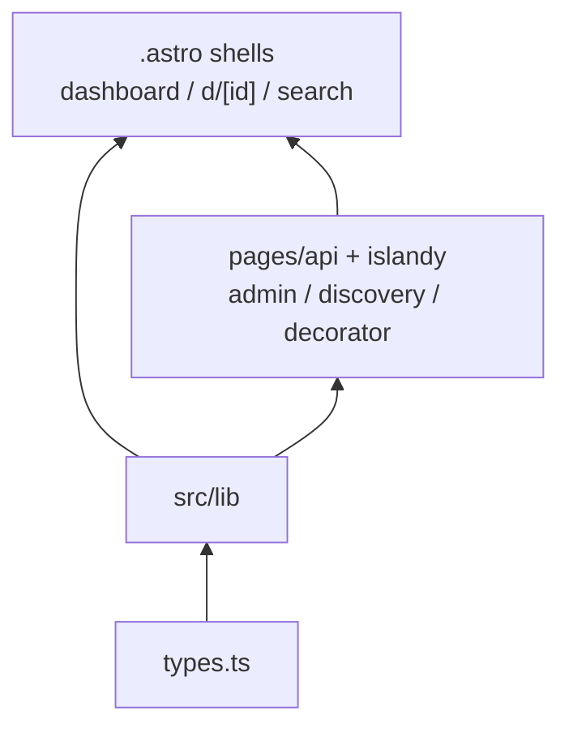

# Mapa projektu EventBook

**Data:** 2026-09-13  
**Dla kogo:** nowa osoba w repo (albo agent) — po ~15 minutach ma wiedzieć, gdzie rzeczy żyją, co jest niebezpieczne i od czego zacząć.

---

## TL;DR

EventBook to **Astro 6 SSR + React islands**: marketplace lead-gen dla dekoratorów i klientów (bez płatności). Stos jest jednokierunkowy: `types` ← `lib` ← handlery `pages/api` i islandy ← shelle `.astro`. Graf TS/TSX to **DAG** — **0 cykli** (74 moduły / 158 krawędzi na `src` + `tests`; 50 / 88 na samym `src`). Praca skupia się w onboardingu dekoratora, kolejce admina i kontrakcie `lib`/`types`; north-star (lead) ma mało commitów, ale cały slice jest w jednym miejscu. Boli nie pętla, tylko **huby kontraktu** (`types.ts` Ca=15, `api-error.ts` Ca=14, `api-auth` / `supabase` Ca=7) i **kompozytorzy poza grafem** (`dashboard.astro`, `d/[id].astro`) plus jeden gruby handler (`api/inquiries`, Ce=6). Folder kłamie: `components/auth` to wspólne pola, nie „tylko logowanie”; `dashboard.astro` to orchestrator admina pod `pages`.

Pierwsze okno: **types → lib → API/islandy → shelle → auth-jako-pola**. Reszta (`ui`, layouty, `tests/`) jest peryferium.

---

## Teren

**Kto odpowiada:** po odfiltrowaniu botów zostaje jedna osoba — **Aleksandra Piasecka**. Nie ma drugiego recenzenta, nie ma zespołu `channels`. Cursor jest `Co-authored-by` w **43/43** commitach: pisał kod, nie jest ekspertem domenowym.

**Rdzeń vs peryferia** (aktywność z subjectów + ścieżek, nie z cruiser-Ca):

| Strefa | Rola | Gęstość (okno 12 mies. = faktyczne ~3 mies.) |
|---|---|---|
| Huby `lib` / auth / middleware / `types` | kontrakt sesji i typów | 9 commitów na ścieżkach |
| Admin / moderacja | analog `admin_console` | 8 — najgęstszy blok subjectów |
| Profil / portfolio | onboarding S-01 | 8 — najdłuższy łańcuch `feat(decorator-onboarding)` |
| Discovery / search | S-02 + mount leada | 4 |
| Inquiry / lead | north-star S-03 | 2 — mało commitów, cały slice |

Peryferia: prymitywy `components/ui`, strony `auth/*`, Vitest/Playwright, leftovery scaffoldu. Tanie przy regeneracji, nie przy zmianie kontraktu.

**Głębokie vs płytkie** *(graf — metrics Ca/Ce/I)*:

- **Głębokie** (dużo wchodzących, mało wychodzących): folder `src/lib` Ca=34, Ce=4, I=11%; `types.ts` I=0%; `api-error.ts` I=0%. Tanie w izolacji, drogie w ripple.
- **Płytkie** (same wychodzące): folder `src/pages` Ca=0, Ce=30, I=100%; islandy admin/discovery I=100%; `middleware.ts` I=100%. To warstwa składania, nie hub.

**Aktywność w czasie — uczciwie:** okno skanu to ostatnie 12 miesięcy (`since=2025-09-13`), ale historia gita to **2026-06-18 → 2026-09-12** (~3 miesiące, 43 commity). Nie ma weteranów „sprzed roku”. Najgorętszy plik 90d to `dashboard.astro` (**7** commitów) — cruiser go nie widzi. Dalej: `dashboard/profile.astro` **4**; `d/[id].astro`, `discovery-query`, `api-auth`, `middleware` — po **3**.

Nie ma pliku `artifact-1-territory.md`. Teren wzięty z `context/foundation/test-plan.md` (hot-spot `src` + `supabase`, ryzyka #1–#6) oraz slice’ów F-01 i S-01–S-04 w `context/foundation/roadmap.md`.

---

## Realne powiązania

Cykle = **0** *(graf)*. Warstwy trzymają się: `types` ↛ `lib`; `lib` ↛ components/pages; feature A ↛ feature B; page ↛ page *(graf TS/TSX; `.astro` — ręczny grep, nie cruiser)*. Koszt zmiany idzie od tego, **co naprawdę rusza się razem**.

**Sprzężenie przez kontrakt** *(graf)*: zmiana `ModerationStatus` / `ContactInquiry` / `DecoratorProfile` w `types.ts` albo kształtu `jsonError` w `api-error.ts` uderza w admin, inquiry i portfolio naraz. `api-auth` (Ca=7) jest bramką admin/portfolio/profile; **inquiry POST tędy nie idzie** (gość). `supabase.ts` w grafie ma Ca=7 — realny fan-in jest wyższy, bo shelle `.astro` też wołają `createClient` *(unknown w cruiserze; grep)*.

**Sprzężenie przez folder, który kłamie** *(graf)*: `components/auth` to zestaw pól. `FormField` (Ca=5) i `ServerError` (Ca=7) używają admin, decorator i discovery. To nie cykl i nie wyciek feature↔feature — ale ktoś, kto czyta katalog jako „tylko logowanie”, zmieni `label`/`id` i zepsuje locatory e2e #3.

**Sprzężenie przez kompozycję poza grafem** *(unknown — cruiser nie widzi `.astro`)*: `dashboard.astro` żyje pod `pages`, a w runtime składa `ModerationQueue` + `moderation-queue` + `supabase` + `locals.isAdmin`. `d/[id].astro` składa filtr approved/published + islandę leada. `search.astro` idzie do `discovery-query` bez islandy. Cruiser przypisuje „pracę pages” handlerom `pages/*.ts`; robotę north-star i admina robią shelle.

**Sprzężenie przez jeden gruby handler** *(graf)*: `api/inquiries/index.ts` (Ce=6) składa abuse + email + schema + supabase + types — jedyny handler z Ce>4. Islandowy rekord Ce to `ProfileForm` (Ce=7), poza top-6 ryzyk test-plan.

**Regeneracja vs ręka:** 43/43 commitów ma trailer Cursor — sprzężenie „agent zregenerował ten sam wzorzec” jest tańsze niż zmiana ręcznie trzymanego kontraktu (`types`, `inquiry-schema`, `api-auth`, RLS). Leftovery scaffoldu (`.scaffold`) nie są hubem. Nie mylić współautorstwa agenta z wiedzą domenową.

Miękkie pułapki (jeszcze nie cykle): nie wciągać `inquiry-schema` do `ContactInquiryForm`; nie importować `lib/*` do `types.ts` (dziś Ce=0); `ModerationQueue` nie importuje `decorator/*`.

---

## Strefy ryzyka

Cztery do sześciu miejsc, gdzie zmiana promieniuje albo test kłamie. Jedna linijka „dlaczego”.

1. **Kontrakt `types.ts` / `api-error.ts`** — liście (Ce=0), ale Ca=15 / 14: jeden enum statusu albo kształt błędu rusza admin + inquiry + portfolio *(graf; test-plan #1–#6)*.
2. **Sesja i gate** (`api-auth`, `supabase`, `middleware`, `PROTECTED_ROUTES`) — jedyna bramka sześciu handlerów; inquiry POST omija `api-auth`; `.astro` woła `createClient` poza Ca=7 *(graf + unknown)*.
3. **North-star inquiry** (`api/inquiries` + `inquiry-abuse` / `inquiry-email`) — kompozytor Ce=6; unit z trzema mockami nie dowodzi „lead w panelu” ani „429 ⇒ brak wiersza”; globalny `Map` izolatu *(graf + test-plan #3/#5)*.
4. **Shell admina** (`dashboard.astro` + `ModerationQueue`) — orchestrator poza grafem; `locals.isAdmin` + kolejka + PATCH; najgorętszy plik 90d *(unknown + git)*.
5. **Widoczność publiczna** (`d/[id].astro`, `search.astro` + `discovery-query`) — filtr approved/published żyje w stronie, nie w `lib`; cruiser tego nie liczy *(unknown; test-plan #1/#6)*.
6. **Wspólne pola `components/auth`** — zmiana `FormField` jednocześnie rusza logowanie, profil, portfolio i lead; folder nie jest granicą feature’u *(graf)*.

---

## Kogo zapytać

Nie ma mapy ekspertów w sensie lekcji. Per strefa: **Aleksandra** + to, co już próbowaliście w archive — nie drugi kontrybutor i nie Cursor.

| Strefa | Kogo | Gdzie szukać, gdy jej nie ma |
|---|---|---|
| Admin / moderacja | Aleksandra | `context/archive/` slice S-04; subjecty `admin-moderation` / `admin-queue-filter` |
| Inquiry / lead | Aleksandra | archive S-03; otwarte `context/changes/contact-lead-flow/` (impl-review) |
| Discovery / search | Aleksandra | archive S-02 (`client-discovery`) |
| Profil / portfolio | Aleksandra | archive S-01 (`decorator-onboarding`) |
| Huby `types` / `api-auth` / middleware | Aleksandra | archive F-01 + seed `domain-schema-foundation`; nie „zespół platform” |

Zanim ruszysz hub albo orchestrator `.astro`: zapytaj Aleksandrę. Git blame wskaże tę samą osobę pięć razy.

---

## Pierwszy dzień

Czytaj w tej kolejności — od kontraktu i sesji do składania, nie od folderu do folderu.

1. `src/types.ts` — wspólny kontrakt (`ModerationStatus`, `ContactInquiry`, `DecoratorProfile`).
2. `src/lib/supabase.ts` — jedyny `createClient()`; nic nie importuje `@supabase/supabase-js` poza tym plikiem.
3. `src/middleware.ts` — `locals.user` / `isAdmin`, lista `PROTECTED_ROUTES`.
4. `src/lib/api-auth.ts` — gate admin/portfolio/profile (inquiry POST tu nie wchodzi).
5. `src/pages/dashboard.astro` — orchestrator admina (poza cruiserem).
6. `src/pages/d/[id].astro` — publiczny profil + mount leada.
7. `src/pages/api/inquiries/index.ts` — jedyny gruby handler (abuse + mail + schema).
8. `src/components/discovery/ContactInquiryForm.tsx` — islanda gościa; walidacja zostaje na serwerze.

Potem, gdy ruszasz test: `context/foundation/test-plan.md` (ryzyka #1–#6, cost × signal) — nie pełna tabela z artefaktu.

---

## Ograniczenia

- **Okno czasowe:** skan kontrybutorów prosił o rok; faktyczna historia to ~3 miesiące (2026-06 → 2026-09). Nie ma „ktoś już próbował rok temu”.
- **Metoda:** dependency-cruiser 18.2.0 na `.ts` / `.tsx` / `.d.ts` (`src` + `tests`). Warstw EventBook **nie** ma w committowanym `forbidden` — werdykt warstw to `--focus` / `--reaches` i ręczny grep. Grafu DOT tej sesji mapping nie renderowano jako źródła mapy (istniejący `artifact-2-archi.svg` to hairball, nie onboarding).
- **`.astro` = unknown, nie „brak sprzężenia”.** Layouty i najgorętsze strony nie wchodzą do Ca/Ce. Kierunek page → lib/island z grepa; cruiser tego nie potwierdza. Nie dopisywać `.astro` do committed `extensions` tylko po to, by narysować stronę.
- **Brak `artifact-1-territory.md`.** Teren = test-plan + roadmap, nie osobny skan territory z lekcji.
- **Mapa nie mówi:** o ruchu produkcyjnym, o RLS poza tym, co widać w stronach, o drugim recenzencie (nie istnieje), ani że `✔ no dependency violations` egzekwuje warstwy (nie egzekwuje).
- **Liczby** wyłącznie z artefaktów sesji 2026-09-13 — bez nowych skanów i bez dopisywania metryk.

Szczegóły: [artifact-2-structure.md](./artifact-2-structure.md), [artifact-3-contributors.md](./artifact-3-contributors.md), [artifact-1-layer-boundaries.md](./artifact-1-layer-boundaries.md), [artifact-1-frontend-cycles.md](./artifact-1-frontend-cycles.md), [artifact-1-testability-risks.md](./artifact-1-testability-risks.md).
